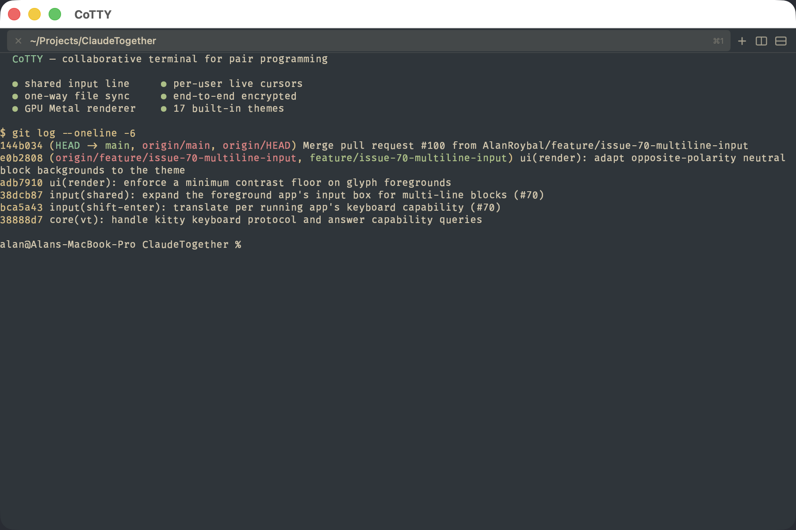
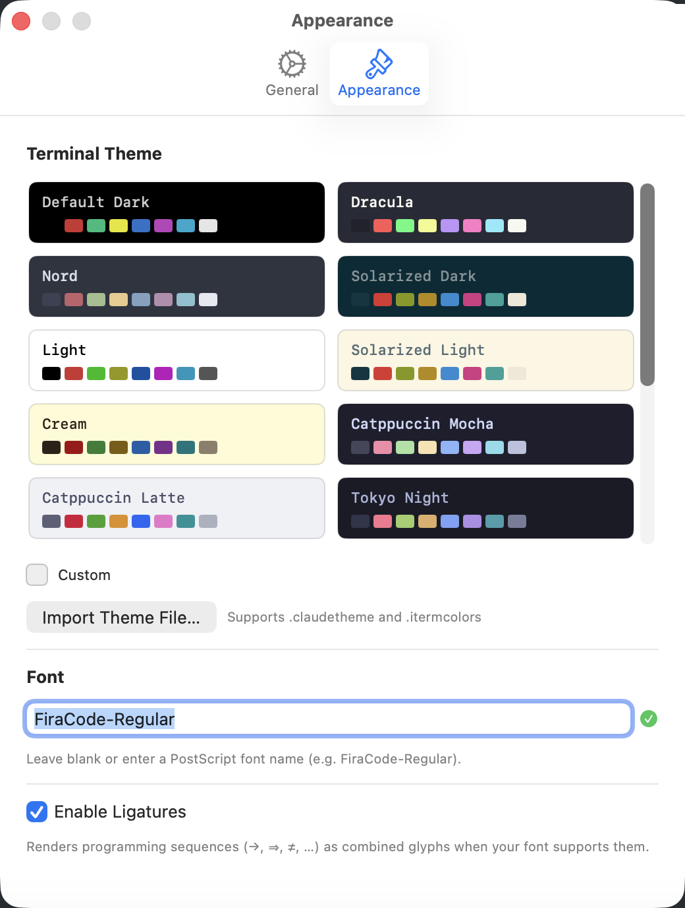
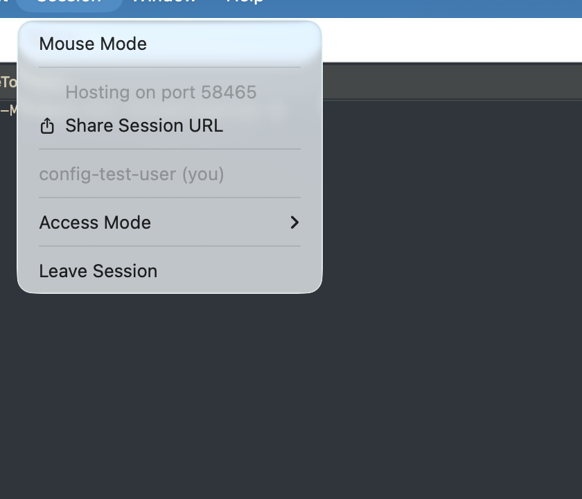

<div align="center">

# CoTTY

### A macOS-native collaborative terminal for pair programming over the internet

[](https://www.apple.com/macos/)
[](https://ziglang.org/)
[](https://developer.apple.com/swift/)
[](#license)

**Share a real shell with anyone over a link.** Every participant edits the same input
line at once — conflict-free, with per-user colored cursors — while CLI tools like
**Claude Code** and **Codex** run only on the host's machine and stream live to everyone else.



</div>

---

## Table of contents

- [What is CoTTY?](#what-is-cotty)
- [Feature highlights](#feature-highlights)
- [Screenshots](#screenshots)
- [How it works](#how-it-works)
- [Getting started](#getting-started)
  - [Prerequisites](#prerequisites)
  - [Build & run](#build--run)
- [Using CoTTY](#using-cotty)
  - [Hosting a session](#hosting-a-session)
  - [Joining a session](#joining-a-session)
  - [The collaborative editor](#the-collaborative-editor)
- [Configuration](#configuration)
- [Keyboard shortcuts](#keyboard-shortcuts)
- [Architecture](#architecture)
- [Wire protocol](#wire-protocol)
- [Roadmap](#roadmap)
- [Non-goals](#non-goals)
- [License](#license)

---

## What is CoTTY?

CoTTY ("Collaborative TTY") is a terminal emulator built from the ground up for **real-time
collaboration**. Unlike screen-sharing or `tmux`-over-SSH, CoTTY is genuinely multi-user:

- **One shared session, many cursors.** When the shell is at a prompt, *everyone* can type
  into the same command line simultaneously. Keystrokes are merged conflict-free and each
  participant gets their own colored cursor — Enter from anyone commits the line.
- **Tools run on the host only.** Interactive tools (Claude Code, Codex, `vim`, `htop`, …)
  execute on the session creator's machine. Output is rendered to every peer; peers never
  need the tool installed locally.
- **Files replicate to peers.** Changes the host makes inside the shared project folder are
  synced one-way to each peer's chosen local folder, so collaborators see edits land on disk.
- **Zero external dependencies.** No Docker, no Homebrew, no SSH keys. The networking tunnel
  is bundled inside the app. Sessions are shared by link.

It's designed for the moment when you want to *actually drive a terminal together* — debugging,
onboarding, mob programming, or pairing with an AI coding agent while a teammate watches and
jumps in.

---

## Feature highlights

### 🤝 Real-time collaboration
- **Shared input line** — all participants edit the same command at the prompt; CRDT-merged so concurrent keystrokes never corrupt each other.
- **Per-user colored cursors** in both the terminal and the editor, with a participant color legend.
- **Live presence & roster** — see who's connected; the host is authoritative for the participant list.
- **Persistent display name** carried across sessions.
- **Access modes** — flip the whole session between **Full Access** and **View Only**.
- **Kick a peer** from the session at any time (host control).
- **Auto-reconnect** — dropped peers reconnect with exponential backoff (up to 8 attempts) and rejoin the roster.
- **Late-join catch-up** — new peers receive the current screen, scrollback history, and a full file snapshot.

### 🖥️ A first-class terminal
- **GPU-accelerated Metal renderer** with a CoreText glyph atlas — smooth at 60 fps, no frame drops while typing fast.
- **Tabs** — multiple shells per window, drag-to-reorder, with per-tab activity indicators.
- **Split panes** — horizontal and vertical splits, each with its own shell.
- **Scrollback search** (`⌘F`) with theme-aware highlights and match navigation.
- **17 built-in themes** + a custom theme editor, plus import of `.claudetheme` and `.itermcolors` files.
- **Programming-font ligatures** (Fira Code bundled by default).
- **OSC 8 hyperlinks** — `⌘`-click to open links embedded in terminal output.
- **Bracketed paste mode** with safe-paste UI, plus file/image drag-and-drop.
- **Adjustable font size**, mouse tracking, and a fully theme-able window chrome.
- **Smart raw-mode handling** — when the host runs a full-screen TUI (vim, claude, codex), CoTTY automatically detects it and adapts the input model.

### 📝 Built-in collaborative editor
- Open any file with **`/edit <path>`** straight from the shared prompt.
- **CRDT-backed** (Replicated Growable Array) so multiple people can edit the same file at once.
- **Syntax highlighting** with language auto-detection.
- **Smart auto-indent** on newline and a **Format with Prettier** command.
- Remote cursors and selections shown in each participant's color.

### 🔒 Networking & security
- **Bundled tunnel** (`bore`) — no port-forwarding or extra installs; works behind NAT.
- **Join-by-link** via a `cotty://` deep link that opens straight from Messages, Mail, or a browser.
- **End-to-end encryption** — the session key travels in the share link, not through the relay.
- **One-way file sync** with path-traversal and symlink-escape protection, atomic writes, and external-edit detection.

---

## Screenshots

<table>
  <tr>
    <td align="center" width="50%">
      <br>
      <em>17 built-in themes, a custom editor, and <code>.itermcolors</code> import</em>
    </td>
    <td align="center" width="50%">
      <br>
      <em>Host a session, share the link, set access mode, manage peers</em>
    </td>
  </tr>
</table>

---

## How it works

```
        Host machine                                   Peer machine(s)
┌──────────────────────────┐                    ┌──────────────────────────┐
│  CoTTY.app               │                    │  CoTTY.app               │
│  ┌────────────────────┐  │   shared input     │  ┌────────────────────┐  │
│  │ zsh / claude / vim │  │◄──────────────────►│  │  rendered mirror   │  │
│  │  (real PTY)        │  │   PTY output ─────► │  │  + local cursor    │  │
│  └────────────────────┘  │   file deltas ────►│  └────────────────────┘  │
│  Metal renderer          │                    │  Metal renderer          │
└───────────┬──────────────┘                    └───────────▲──────────────┘
            │                bundled bore tunnel            │
            └──────────────►  relay (public link)  ─────────┘
```

- Tools run in a **real PTY on the host**. Their byte stream is broadcast to peers and
  re-rendered by the same VT engine, so everyone sees identical output.
- At a shell prompt, keystrokes from any participant are merged into a **single shared input
  line** and committed to the host PTY on Enter.
- When the host enters a full-screen app, CoTTY detects the raw/alt-screen mode and switches
  the input model accordingly.
- The host watches the project folder and ships **per-file deltas** to peers, who apply them
  atomically inside their own chosen root.

---

## Getting started

> CoTTY is macOS-only and currently distributed as a source build (alpha). A signed/notarized
> `.dmg` is on the [roadmap](#roadmap).

### Prerequisites

| Tool | Version | Notes |
|------|---------|-------|
| **macOS** | 14.0+ | Apple Silicon or Intel |
| **Xcode** | 26.5+ | Includes the Metal toolchain component (see below) |
| **Zig** | 0.16.0 | Builds the `libcollabterm` core (`~/.local/bin/zig`) |
| **xcodegen** | latest | Generates the Xcode project from `project.yml` (`~/.local/bin/xcodegen`) |

First-time Xcode setup (only needed once after installing/upgrading Xcode):

```bash
sudo xcodebuild -runFirstLaunch
xcodebuild -downloadComponent MetalToolchain   # ~688 MB; the metal compiler is no longer bundled
```

### Build & run

```bash
# 1. Clone
git clone <repo-url> CoTTY && cd CoTTY

# 2. Configure the tunnel relay (copy the template and fill in your values)
cp macos/Secrets.xcconfig.example macos/Secrets.xcconfig
#    edit macos/Secrets.xcconfig:
#      BORE_SERVER = relay.cotty.app          # your bore relay host
#      BORE_SECRET = <your-bore-secret>       # the --secret your relay expects

# 3. Build everything: bundled tunnel → Zig core → Xcode project → app
./scripts/build-all.sh

# 4. Launch
open build/Build/Products/Debug/CoTTY.app
```

`scripts/build-all.sh` runs the full pipeline end-to-end:

1. `build-bore.sh` downloads and `lipo`s a universal `bore` binary into the app's resources.
2. Builds the Zig static library (`libcollabterm.a`) and repackages it for Apple's linker.
3. Runs `xcodegen` to generate `macos/CoTTY.xcodeproj`.
4. Builds the `.app` with `xcodebuild`.

The finished app lands at `build/Build/Products/Debug/CoTTY.app`.

---

## Using CoTTY

### Hosting a session

1. **Choose a project folder** — `⌘⇧O`, or you'll be prompted on first share. The host shell
   runs inside this folder, and its contents sync to peers.
2. **Session → Start Shared Session.** CoTTY spins up the local server and opens the bundled
   tunnel to your relay.
3. **Session → Share Session URL** (`⌘⇧U`) copies a `cotty://join?...` link (with the
   encryption key embedded). Send it to your collaborators.
4. Manage the session from the **Session** menu: set **Access Mode** (Full / View Only), see
   the participant roster, or **Remove** a peer.

### Joining a session

1. **Session → Join Shared Session…** and paste the `cotty://` link (or `host:port`).
   Opening the link from Messages/Mail/a browser also launches CoTTY directly.
2. **Pick a local folder** to act as your session root — synced files land here.
3. You'll see the host's tabs, screen, and scrollback. If the host granted **Full Access**,
   start typing — your keystrokes merge into the shared input line.

### The collaborative editor

From the shared prompt, type:

```
/edit src/main.zig
```

This opens the file in CoTTY's built-in editor. Everyone in the session can edit it at the
same time, with syntax highlighting, smart auto-indent, and live remote cursors. Save with
`⌘S`, format with **Format → Format with Prettier** (`⌥⌘P`), and close with `⌘W`.

---

## Configuration

CoTTY reads an optional TOML file at **`~/.config/CoTTY/config.toml`**, hot-reloaded on save:

```toml
[terminal]
font_size = 14                 # default 13
font_name = "FiraCode-Regular" # PostScript name; falls back to system monospace
ligatures = true               # default true
theme     = "Dracula"          # any built-in or imported theme name
custom_bg = "1E1E2E"           # hex; used when theme = "Custom"
custom_fg = "CDD6F4"

[session]
display_name = "Alice"         # shown in the participant roster
bore_server  = "bore.pub"      # relay host (leave empty to use ngrok mode)
```

Most of these are also editable in **Preferences** (`⌘,`):

- **General** — display name, core version, and tunnel diagnostics.
- **Appearance** — theme swatch picker, custom colors, font, ligatures, and theme import.

Imported themes (`.claudetheme` / `.itermcolors`) are stored under
`~/.config/claudetogether/themes/` and auto-discovered.

---

## Keyboard shortcuts

| Action | Shortcut |
|--------|----------|
| New tab | `⌘T` |
| Close tab | `⌘W` |
| Select tab 1–9 | `⌘1` … `⌘9` |
| Next / previous tab | `⌘⇧]` / `⌘⇧[` |
| Choose project folder | `⌘⇧O` |
| End session | `⌘⇧W` |
| Split pane horizontally / vertically | `⌘D` / `⌘⇧D` |
| Close split pane | `⌘⇧P` |
| Focus next pane | `⌥⌘Tab` |
| Find / next / previous | `⌘F` / `⌘G` / `⌘⇧G` |
| Copy / paste | `⌘C` / `⌘V` |
| Clear screen | `⌘K` |
| Increase / decrease / reset font size | `⌘+` / `⌘-` / `⌘0` |
| Format with Prettier (editor) | `⌥⌘P` |
| Share session URL | `⌘⇧U` |
| Preferences | `⌘,` |

> In the shared input line, **Shift+Enter** inserts a newline (for multi-line prompts in tools
> like Claude) instead of committing.

---

## Architecture

```
CoTTY/
├── core/                       # Zig static library (libcollabterm, C ABI)
│   ├── build.zig
│   ├── include/collabterm.h
│   └── src/
│       ├── lib.zig             # C ABI exports
│       ├── pty.zig             # forkpty + termios raw-mode probe
│       ├── vt.zig              # VT/CSI/SGR parser, alt-screen, OSC 8
│       ├── grid.zig            # cell grid, cursor, scrollback
│       ├── term.zig            # parser + grid glue
│       ├── utf8.zig            # incremental UTF-8 decoder
│       ├── transport.zig       # TCP listener/client, length-prefixed frames
│       ├── session.zig         # accept loop + per-peer readers
│       ├── frame.zig           # wire protocol encode/decode
│       ├── bore.zig            # bundled-tunnel supervisor
│       └── crdt.zig            # Yjs-style RGA sequence CRDT
├── macos/                      # Swift app
│   ├── project.yml             # xcodegen spec
│   ├── Sources/
│   │   ├── App.swift           # scene, menus, shortcuts, preferences
│   │   ├── ContentView.swift   # model wiring, shared input, /edit
│   │   ├── Terminal/           # Metal renderer, grid model, themes, search
│   │   ├── Editor/             # collaborative editor + syntax highlighter
│   │   ├── Session/            # SessionManager, SharedInput, FS sync, crypto
│   │   ├── Bridge/             # Swift ⇄ Zig C-ABI wrappers, FrameCodec
│   │   └── Metal/Shaders.metal
│   ├── Resources/bore          # bundled universal tunnel binary
│   └── Vendor/                 # libcollabterm.a + header + module map
└── scripts/
    ├── build-bore.sh           # fetch + lipo universal bore
    └── build-all.sh            # bore → zig → xcodegen → xcodebuild
```

- **Core (Zig):** PTY, VT parsing, grid model, transport, session management, and the CRDT —
  compiled to a static library and called from Swift over a C ABI.
- **UI (Swift + AppKit/SwiftUI):** windowing, menus, the Metal terminal/editor renderers,
  shared-input state, file-system watching, and session crypto.
- **Tunnel (`bore`):** bundled as nested, code-signed helper under `Contents/Helpers/`.

---

## Wire protocol

Binary, length-prefixed frames identified by a 1-byte tag:

| Tag  | Frame        | Direction          |
|------|--------------|--------------------|
| 0x01 | PtyOutput    | host → peers       |
| 0x02 | InputOp      | any → all          |
| 0x03 | InputCommit  | any → all          |
| 0x04 | FsDelta      | host → peers       |
| 0x05 | FsSnapshot   | host → new peer    |
| 0x06 | CursorPos    | any → all          |
| 0x07 | Hello        | on connect         |
| 0x08 | ModeChange   | host → peers       |
| 0x09 | Roster       | host → peers       |
| 0x0A | Heartbeat    | any → session      |
| 0x20 | Kick         | host → peer        |

The frame set is extended at the Swift layer for editor operations, presence, and tab/pane
lifecycle events tunneled over the same connection.

---

## Roadmap

- [x] GPU Metal renderer with full VT support
- [x] Multi-user shared input with colored cursors
- [x] One-way file sync with safety checks
- [x] Raw-mode (TUI) detection and fallback
- [x] Collaborative editor with CRDT + syntax highlighting
- [x] Themes, ligatures, OSC 8, bracketed paste, search, tabs, split panes
- [x] End-to-end encrypted sessions
- [ ] ≥3-peer stress testing
- [ ] Code signing + notarization, `.dmg` for releases
- [ ] QR code for session sharing

---

## Non-goals

To keep the product focused, the following are explicitly **out of scope** (ask before adding):

- Windows / Linux support
- Bidirectional file sync
- Accounts / authentication (the session link *is* the capability)
- Persistent sessions
- Built-in voice / video / chat

---

## License

Proprietary — © Alan Roybal. All rights reserved.
